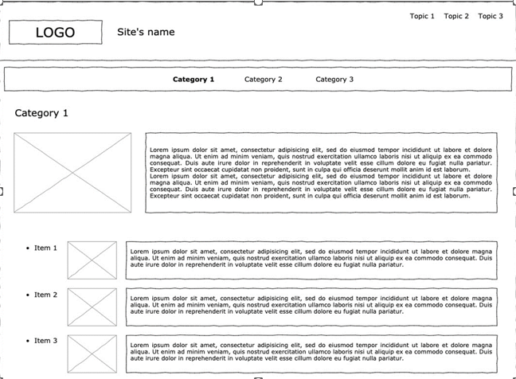
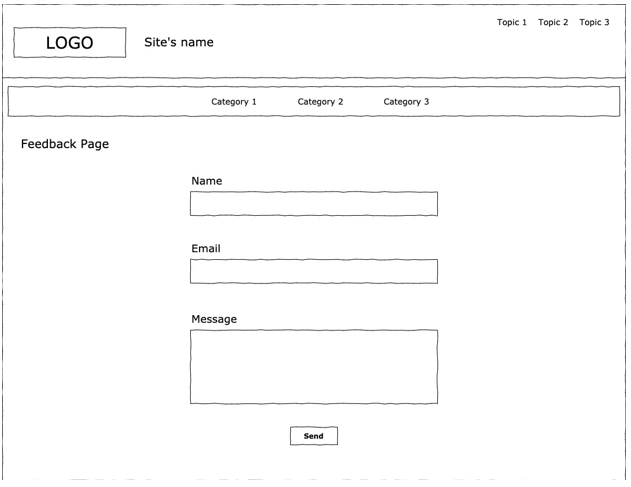
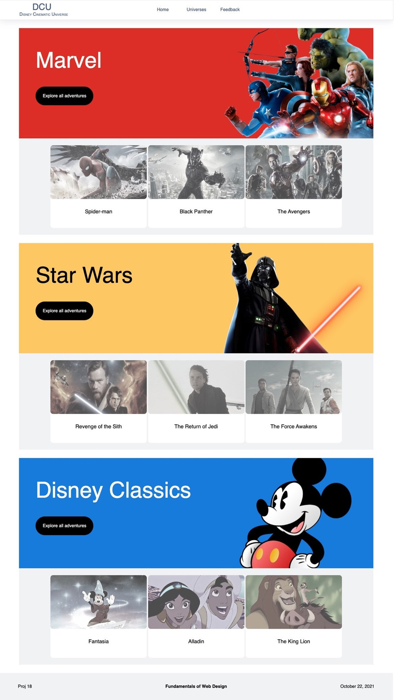

Creative Brief
Date: November 21, 2023

Re: Term Project – Creative Brief;

Project Overview
This project is a movie website primarily focused on Disney movies. It will be developed using programming languages such as HTML and CSS, complemented by additional frameworks for enhanced functionality and design.

Main Theme:
i unanimously agreed upon featuring Disney movies as the primary theme. The website will be divided into three sub-themes:

Marvel movies
Star Wars movies
Disney classic movies
Design Elements
Text Font
We’ve outlined the fonts for different sections of the website:

Website Title & Disney Classic Movies: "Waltograph" family font
Marvel Movies: "Fakt Soft Pro" font family
Star Wars: Combination of "News Gothic" and "Univers"
Paragraphs: "Matterhorn" font family
Colors
Each sub-theme will have its unique color palette:

Disney Classics: Golden, dark blue for background, black for details
Marvel: Red, White, and Graphite for background
Star Wars: Yellow, White, and Black
Content
The website will feature images from pivotal moments in the movies. We've curated a list of movies to showcase:

Disney Classics
Fantasia (1940)
Pinocchio (1940)
Bambi (1942)
Alice in The Wonderland (1951)
Sleeping Beauty (1959)
The Sword in the Stone (1963)
Aladdin (1992)
The Lion King (1994)
MCU – Marvel Cinematic Universe (sagas from each)
Iron Man
Black Panther
Avengers
Spider Man
Guardians of the Galaxy
Doctor Strange
Captain Marvel
The Incredible Hulk
Thor
Star Wars Movies
EP. I – The Phantom Menace (1999)
EP. II – Attack of the Clones (2002)
EP. III – Revenge of the Sith (2005)
EP. IV – A New Hope (1977)
EP. V – The Empire Strikes Back (1980)
EP. VI – Return of the Jedi (1983)
EP. VII – The Force Awakens (2015)
EP. VIII – The Last Jedi (2017)
EP. IX – The Rise of Skywalker (2019)
Rogue One (2016)
Mock-ups
We've developed initial wireframes and main visuals to guide the website's layout:

